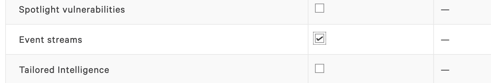
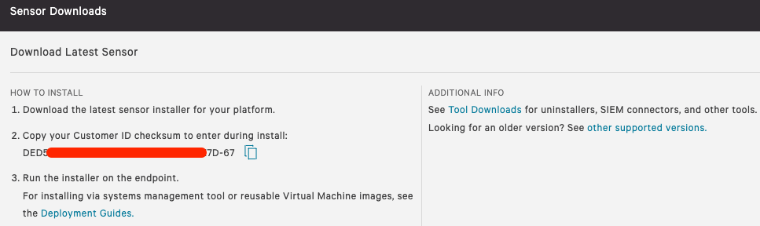
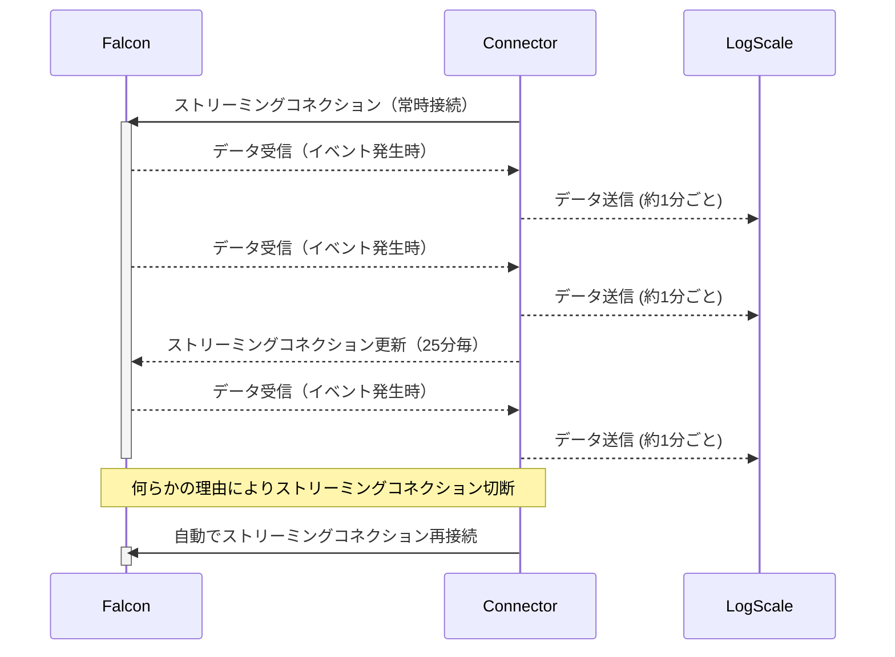

# はじめに
このスクリプトはCrowdStrike FalconのStreaming APIからイベントを取得し、LogScale Community Editionに送信するConnectorです。
このスクリプトを含んだコンテナイメージを以下で公開しています。  
https://hub.docker.com/r/prex55/cs-stream-logscale-connector

本手順ではコンテナイメージを用いてログを送信する方法を説明します。

### 用語説明
- LogScale Community Edition  
CrowdStrike LogScaleの無償版です。制限（ログ容量16GB/日、保存期間7日）がありますがどなたでもご利用頂けます。

- Streaming API  
Falconのイベントを取得するAPIです。検知したイベントや管理者の操作ログなどが取得できます。
取得できるイベントの詳細はFalconオンラインマニュアルの `Streaming API Event Dictionary` をご覧ください。


# 使い方

### LogScaleでの準備
1. 下記ページの Falcon LogScale Community Edition > Join Community にてLogScale Community Edtionのアカウント作成します。  
https://www.crowdstrike.com/products/observability/falcon-logscale/#get-started    
※アカウント作成には1〜2日かかります。

2. レポジトリの作成

3. CrowdStrike siem-connectorのインストール

4. Ingest Tokenの取得
  
  
### Falconコンソールでの準備
1. API Client keyとSecret  
Support and resources > API clients and keys > Add new API client　にてAPIキーを作成します。  
Event streams の Readにチェックを入れてください。作成されたClient IDと Secretをコピーしておきます。



2. CID  
Host setup and management > Sensor downloads にてCIDをコピーします。



3. API Base URL  
ご利用の環境により異なります。  
US-1: https://api.crowdstrike.com  
US-2: https://api.us-2.crowdstrike.com  
EU-1: https://api.eu-1.crowdstrike.com  


### 設定ファイルの準備
以下の内容を`config.env`として保存してください。
```
CS_CLIENT_ID=XXXXX
CS_CLIENT_SECRET=XXXXX
CS_APIURL=https://api.crowdstrike.com
STREAM_APPID=cs-stream-logscale-connector
LS_URL=https://cloud.community.humio.com/api/v1/ingest/hec/raw
LS_INGEST_TOKEN=XXXXX
PROCESS_CHECK_INTERVAL=60

# Option: You can specify an offset to start retrieving events from the specific offset.
CS_STREAM_OFFSET=
```
保存した`config.env`を環境に合わせて編集します。編集箇所は XXXXX 部分と、CS_APIURLだけで構いません。


### コンテナの起動

構文
```
docker run -d --env-file [config.env path] --name cslc prex55/cs-stream-logscale-connector:[tag]
```

実行例
```
docker run -d --env-file ./config.env --name cslc prex55/cs-stream-logscale-connector:1.1
```


### 稼働状況の確認コマンド
```
 docker logs -f cslc
```

## 補足
- コンテナを再起動した場合も、前回取得したイベント以降から取得を開始します。

- 長期間イベントが発生しない場合、Streaming APIの接続が切断されることがあります。(環境に依存します。5分程度で切断されることもあります)。  
しかしご安心ください。このコンテナは自動的に再接続します。(再接続には最大で1時間程度かかる場合があります)。


## トラブルシューティング
- ログに`401 Unauthorized`が出力される場合は、CS_CLIENT_ID または CS_CLIENT_SECRET に誤りがあります。config.envを修正し、コンテナを起動し直してください。

```
Mon Dec 19 00:19:30 UTC 2022 --- Query offset -
Mon Dec 19 00:19:30 UTC 2022 --- getting oauth2 token
curl: (22) The requested URL returned error: 401 Unauthorized
Mon Dec 19 00:19:31 UTC 2022 --- getting streaming url
curl: (22) The requested URL returned error: 401 Unauthorized
```

- 以下のエラーは、config.envのSTREAM_APPIDが他のStreamin APIを利用しているアプリケーションと重複していることを示しています。別の文字列に変更してください。（STREAM_APPIDには任意の文字列を使用可能です）。  
他のアプリケーションが存在しない場合は、このエラーは一時的なものです。30分ほど待てば解消します。

```
jq: error (at <stdin>:1): Cannot iterate over null (null)
```


## 処理フロー
