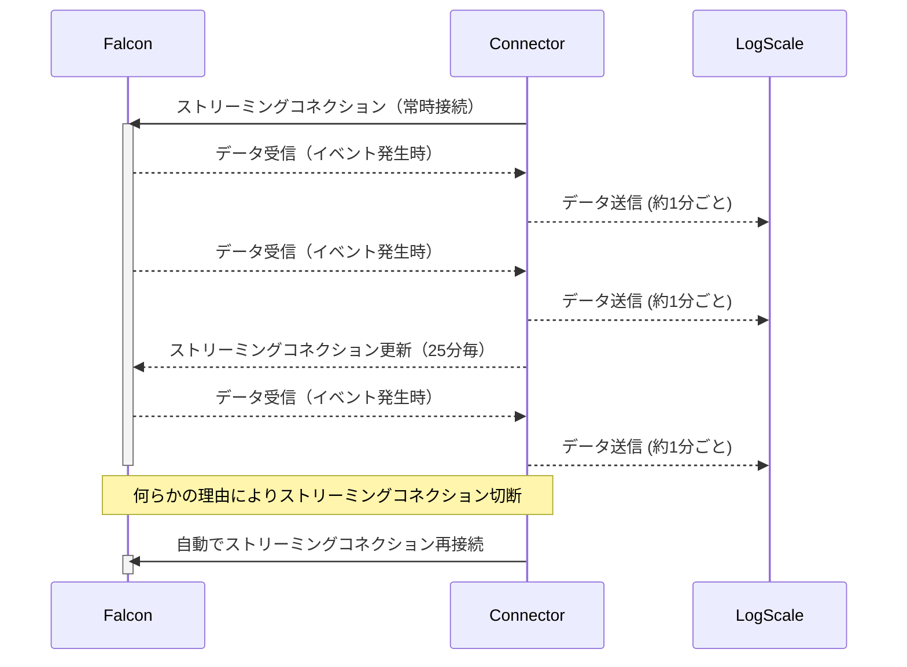

## はじめに
CrowdStrike FalconのStreaming APIからイベントを取得し、LogScale Community Editionに送信するConnectorです。
コンテナイメージで提供しております。以下からご利用ください。
https://hub.docker.com/r/prex55/cs-stream-logscale-connector

## 用語説明
- LogScale Community Edition  
CrowdStrike LogScaleの無償版です。1日あたりログ容量16GB、保存期間1週間という制限がありますがどなたでもご利用頂けます。

- Streaming API  
Falconのイベントを取得するAPIです。検知したイベントや管理者の操作ログなどが取得できます。
詳細はFalconのオンラインマニュアルの **Streaming API Event Dictionary** をご覧ください。


## 動作イメージ



## 使い方

### LogScaleの準備
1. 下記ページからLogScaleコミュニティエディションのアカウント作成。
https://www.crowdstrike.com/products/observability/falcon-logscale/#get-started  

Falcon LogScale Community Edition > Join Communityを選択してください。

2. 


### Falcon Streaming APIの準備
以下の4点をご準備ください。
- API Client keyとSecret 　
Support and resources > API clients and keys > Add new API client　にてAPIキーを作成します。  
Event streams の Readにチェックを入れてください。作成されたClient IDと Secretをコピーしておきます。


- CID
- API Base URL  
ご利用の環境により異なります。
US-1: https://api.crowdstrike.com
US-2: https://api.us-2.crowdstrike.com
EU-1: https://api.eu-1.crowdstrike.com


### 設定ファイルの準備
以下の内容を環境に合わせて編集し、`config.env`として保存してください。
```
CS_CLIENT_ID=XXXXX
CS_CLIENT_SECRET=XXXXX
CS_APIURL=https://api.crowdstrike.com
STREAM_APPID=cs-stream-logscale-connector
LS_URL=https://cloud.community.humio.com/api/v1/ingest/hec/raw
LS_INGEST_TOKEN=XXXXX
PROCESS_CHECK_INTERVAL=60

# Option: You can specify an offset to start retrieving events from the specific offset.
CS_STREAM_OFFSET=
```
編集箇所は XXXXX 部分と、CS_APIURLだけで構いません。