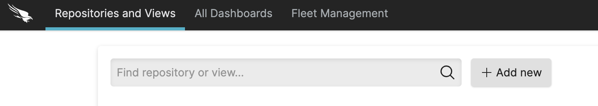
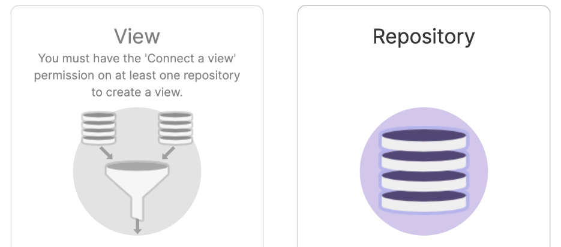
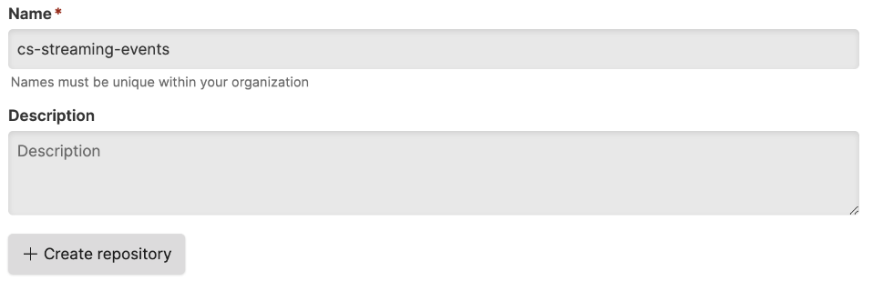
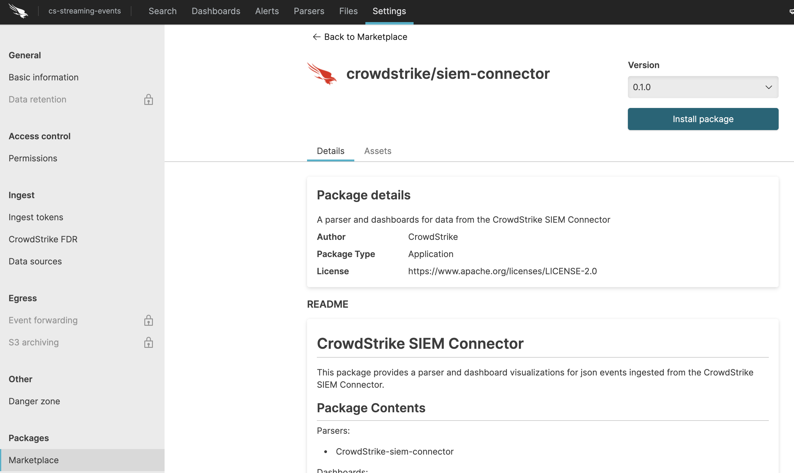
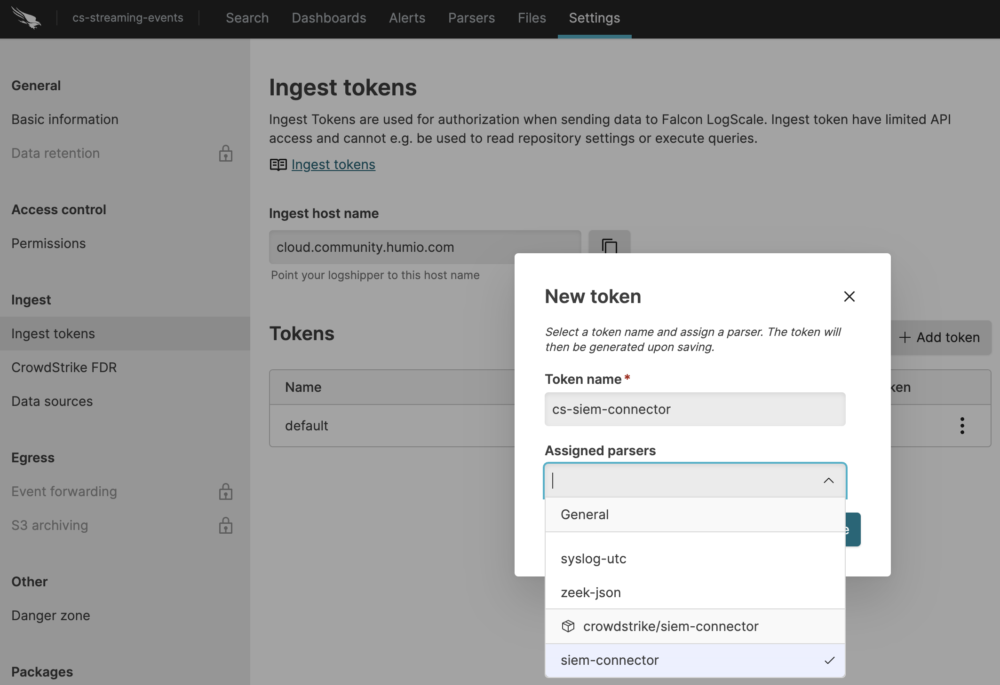
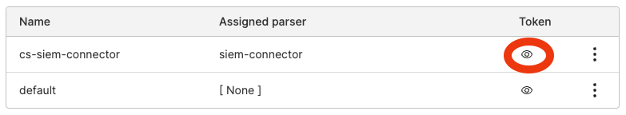
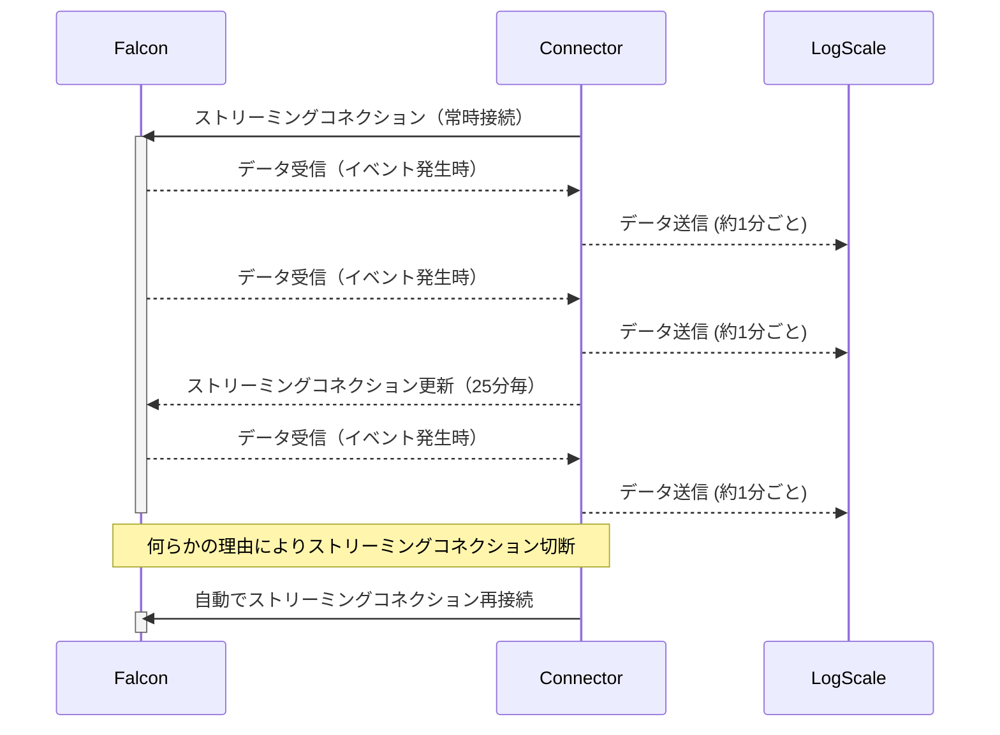

# はじめに
本ドキュメントは以下で公開しているコンテナイメージの日本語説明資料です。  
https://hub.docker.com/r/prex55/cs-stream-logscale-connector

このコンテナを使用することで、CrowdStrike FalconのStreaming APIからイベントを取得し、LogScale Community Editionに送信することができます。


# 用語説明
- LogScale Community Edition  
CrowdStrike LogScaleの無償版です。制限（ログ容量16GB/日、保存期間7日）がありますがどなたでもご利用頂けます。

- Streaming API  
Falconのイベントを取得するAPIの一つです。検知したAlertや管理者の操作ログなどが取得できます。
取得できるイベントの詳細はFalconオンラインマニュアルの `Streaming API Event Dictionary` をご覧ください。


# 使い方

### LogScaleでの準備
1. LogScale Community Editionのアカウント作成  
[こちら](https://www.crowdstrike.com/products/observability/falcon-logscale/#get-started)にアクセスし、Falcon LogScale Community Edition > Access now にてアカウントを作成します。  
※アカウント作成には1〜2日かかります。

1. レポジトリの作成  
Repository and ViewsにてAdd newをクリックします。

Repositoryを選択します。
  
任意のRepository名を入力し、Create repositoryをクリックします。


1. CrowdStrike siem-connectorのインストール  
   Settings > Packages > Marketplace にて `crowdstrike/siem-connector` を選択しInstall します。


1. Ingest Tokenの取得  
   Settings > Ingest > Ingets tokens にて Add tokenをクリックし以下のように設定します。  
   Token Name: 任意の名前  
   Assigned parsers: siem-connector
  
  作成されたTokenのアイコンをクリックすると、Ingest Tokenの文字列が表示されますので、**コピー**しておきます。
  

### Falconコンソールでの準備
1. API Client keyとSecret の取得  
Support and resources > API clients and keys > Add new API client　にてAPIキーを作成します。  
ScopeはEvent streams の Readにチェックを入れてください。

作成されたClient IDと Secretを**コピー**しておきます。

2. CIDの取得  
Host setup and management > Sensor downloads にてCIDを**コピー**します。


3. API Base URL の取得  
リージョンにより異なります。各リージョンのURLは以下になります。  
US-1: https://api.crowdstrike.com  
US-2: https://api.us-2.crowdstrike.com  
EU-1: https://api.eu-1.crowdstrike.com  


### 設定ファイルの準備
以下の内容を`config.env`として保存してください。
```
CS_CLIENT_ID=XXXXX
CS_CLIENT_SECRET=XXXXX
CS_APIURL=https://api.crowdstrike.com
STREAM_APPID=cs-stream-logscale-connector
LS_URL=https://cloud.community.humio.com/api/v1/ingest/hec/raw
LS_INGEST_TOKEN=XXXXX
PROCESS_CHECK_INTERVAL=60

# Option: You can specify an offset to start retrieving events from the specific offset.
CS_STREAM_OFFSET=
```
保存した`config.env`を環境に合わせて編集します。編集箇所は XXXXX 部分と、CS_APIURLだけで構いません。


### コンテナの起動

構文
```
docker run -d --env-file [config.envのパス] --name cslc prex55/cs-stream-logscale-connector:[tag]
```

実行例
```
docker run -d --env-file ./config.env --name cslc prex55/cs-stream-logscale-connector:2.1
```


### ログ表示コマンド
```
 docker logs -f cslc
```

### 補足
- 本コンテナが正常にイベント送信を行なっても、LogScaleの画面上にイベントが表示されるまで10分程度かかることがあります。これはLogScale Community Editionのログ保管期間が1週間であることと、その「1週間」はイベントのタイムスタンプを元に計算しているためです。Streaming APIはFalconに蓄積された古いイベント情報から順次出力しますが、LogScaleは1週間以上前のイベントを無視します。


- コンテナ再起動を行なっても前回取得したイベント以降から取得再開します。これはコンテナ内部に取得済みイベントのoffsetを保持しているためです。コンテナを再作成すると、offsetの情報が無くなるため、イベントが重複する可能性があります。

- 長期間イベントが発生しない場合、Streaming APIの接続が切断されることがあります。(環境に依存します。5分程度で切断されることもあります)。  
しかしご安心ください。このコンテナは自動的に再接続します。再接続には最大で1時間程度かかる場合があります。


# トラブルシューティング
- ログに`401 Unauthorized`が出力される場合は、CS_CLIENT_ID または CS_CLIENT_SECRET に誤りがあります。config.envを修正し、コンテナを起動し直してください。

```
Mon Dec 19 00:19:30 UTC 2022 --- Query offset -
Mon Dec 19 00:19:30 UTC 2022 --- getting oauth2 token
curl: (22) The requested URL returned error: 401 Unauthorized
Mon Dec 19 00:19:31 UTC 2022 --- getting streaming url
curl: (22) The requested URL returned error: 401 Unauthorized
```

- 以下のエラーは、Connectorが複数起動している場合に発生します。他のConnectorを停止してください。もし複数起動させたい場合はconfig.envのSTREAM_APPIDをConnector毎にユニークな文字列に変更してください。（STREAM_APPIDには任意の文字列を使用可能です）。  
Connectorが複数起動していないにも関わらずこのエラーが出力される場合は、一時的なものと考えられます。30分ほど待てば解消します。

```
jq: error (at <stdin>:1): Cannot iterate over null (null)
```


# 参考: 処理フロー
